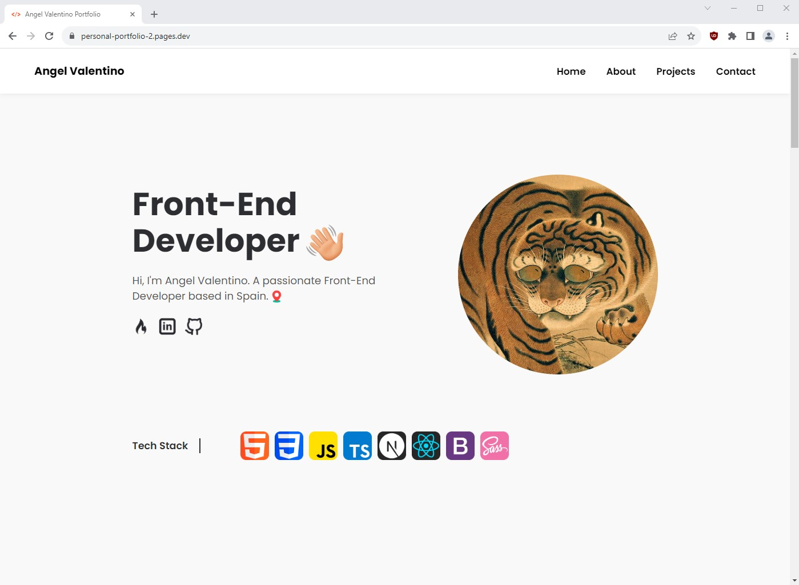
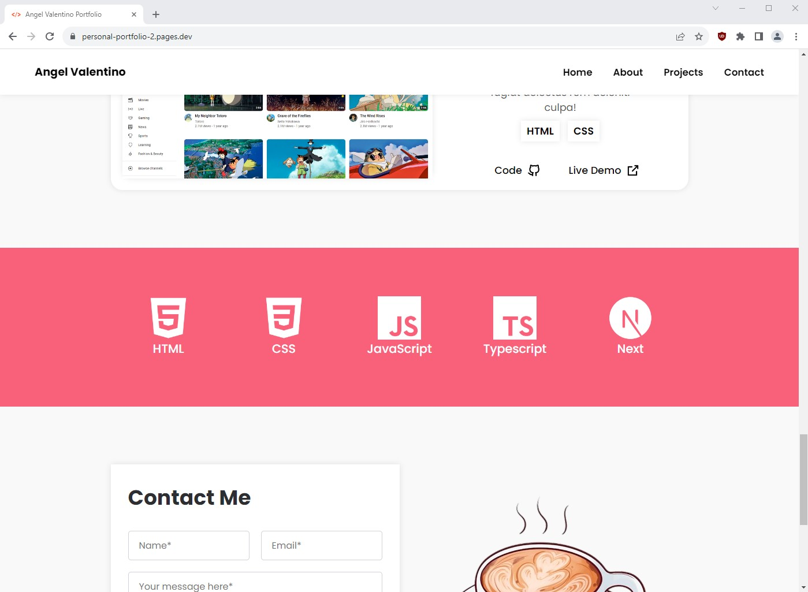

# [Personal Portfolio 2](https://personal-portfolio-2.pages.dev/)

 

 

 

# Final project after 2 months of studying HTML and CSS

 

 

 

## Implemented Features

- Responsive design

- Hover differentiation between hover capable deveices and not hover ready devices

- Changed font size of clickable elements to be easier to use with touch screen devices

- Implemented color variables for an easier webpage customization

- Still isn't 100% complete due to the lack of JavaScript
