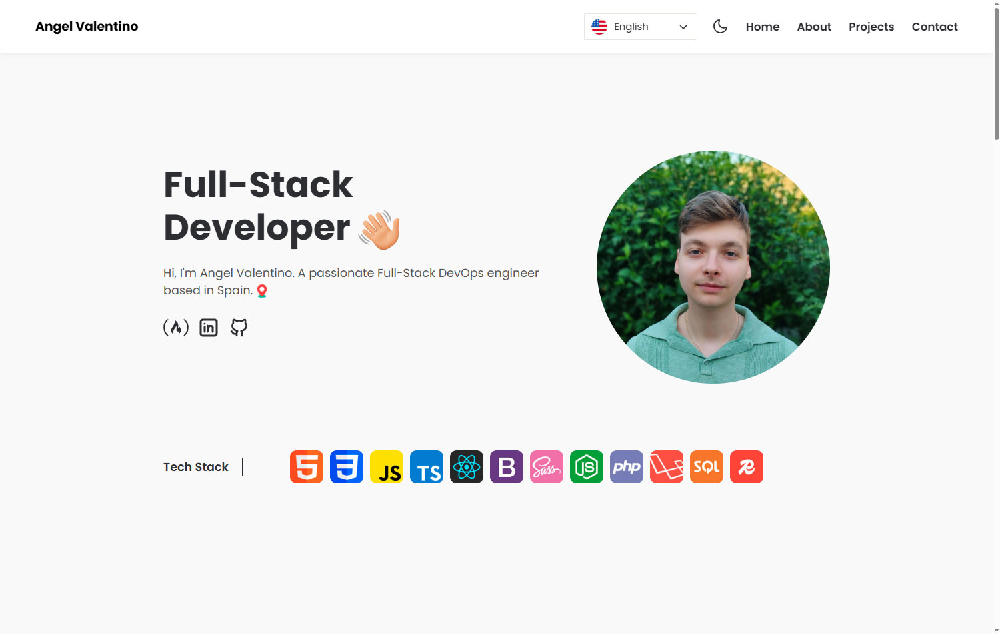
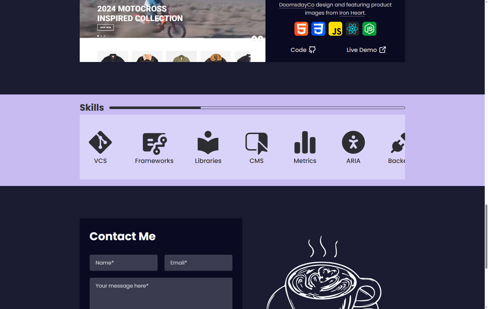
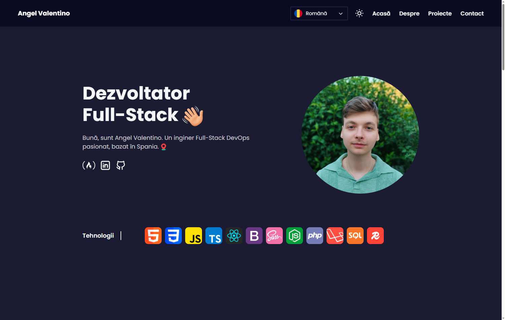

# Vanilla JavaScript Accessible and Simple Portfolio / Angel Valentino



## 📋 About

The following [portfolio](https://angelvalentino.dev/) is a solid, well-organized vanilla JavaScript project built with a **modular architecture**. It thoughtfully combines procedural, object-oriented, and functional programming techniques to keep the codebase simple, modular, and maintainable.

Designed with a strong emphasis on **simplicity**, **accessibility**, and **user experience**, the site ensures it's usable and enjoyable for all visitors, regardless of their device or ability. 

This project shows practical coding skills without using heavy frameworks. It highlights a strong understanding of core JavaScript and good web development practices.


### 🌟 Acknowledgements

This project draws inspiration from several sources that helped shape its development:

- Several **YouTube tutorials**, **forums**, and online documentation, such as **W3Schools** and **MDN**, provided valuable insights, covering everything from technical documentation to modern accessibility, security, and deployment practices.

<br>

## 🚀 Features

- 🏗️  **Modular Architecture:** Clean separation of concerns using ES module imports and exports, ensuring maintainable and scalable code.
- 🧩 **Mixed Programming Paradigms:** Combines procedural, object-oriented, and functional programming techniques for simplicity and flexibility.
- 🌐 **Multi-language Support:** Dynamic language selection for both desktop and mobile, with real-time content translation based on user preference.
- 🎨 **Dark and Light Theme Toggle:** Smooth theme switching with user preferences saved in local storage, enhancing comfort and accessibility.
- 📱 **Responsive, Dynamic Interface Across All Devices:** Fully responsive design using vanilla CSS and media queries to adapt seamlessly across desktops, tablets, mobiles, and more.
- 🌍 **Accessibility Focus:** Designed with inclusivity in mind, including keyboard-navigable menus and ARIA support for screen readers.
- 🖼️ **Progressive Image Loading:** Optimized images with blur load placeholders that improve performance and perceived speed.
- ⬆️ **Scroll-Based UI Enhancements:** Dynamic navbar behavior and a scroll-to-top button enhance navigation and screen space usage.
- ⚡ **Optimized Performance:** Minimal dependencies and lightweight vanilla JS deliver fast load times. Achieves near-perfect scores in Google Lighthouse for performance, accessibility, best practices, and SEO.

### 📊 Audit and Security Scores

Below are the actual audit and security test results demonstrating the portfolio’s performance and integrity.


<br>

## 🧪 Local Development

The portfolio was fully designed and built by me, from layout to logic. You are welcome to use it as a base for your own project. Just a mention would be appreciated.

It's open source because I believe in sharing, especially with so few accessible, vanilla stack portfolios out there. If it was helpful, that is what matters most.

To use it locally for development, you can clone the repository from GitHub and open it with a Live Server (such as the VS Code extension) to see real-time updates as you work.

```bash
git clone https://github.com/AngelValentino/personal-portfolio.git
```

<br>

## 🌱 Personal Portfolio: Evolution, Features and Limitations

### A Simple Yet Modern and Accessible Portfolio

- **Goal**: A simple and accessible portfolio, responsive across all screen sizes, and easy to read and interact with.
- **Crafted with care**: Every aspect of the portfolio, from the frontend to interactive features, was thoughtfully developed following best practices, with a strong focus on accessibility, performance, and user-centered design.
- **Accessible Event Handling**: The toggle modal events function was implemented to add the necessary accessible event listeners. This function is a streamlined version of the event handler used in [taskflow](https://github.com/AngelValentino/TaskFlow), providing adequate functionality for a project of this scope.

### Current Limitations

Although the portfolio uses a mix of programming patterns and best practices, they were kept as simple as possible, without relying on an MVC architecture or similar. This makes the codebase simpler, but it also limits scalability. To scale this project effectively, it would need to be refactored into MVC or another architectural pattern.

Notwithstanding, there are no current plans to update this portfolio, as it's considered to already fulfill its purpose in a clear, accessible, and responsive way.

### Accessibility (a11y)

- **Inclusive Design**: The portfolio is built with inclusivity in mind, ensuring the interface is intuitive and easy to navigate for all users, including those with disabilities.
- **Keyboard Navigation**: Full keyboard support allows users to navigate and interact with all features without relying on a mouse or touch input.
- **ARIA Support**: ARIA attributes are applied judiciously to enhance accessibility without overcomplicating the markup, ensuring smooth interaction with screen readers and other assistive technologies.
- **Semantic HTML**: Semantic HTML elements are used throughout to improve both accessibility and SEO, enabling assistive technologies to accurately interpret the content structure.
- **Multilingual Support and Accessible Language Selector**: The portfolio includes a fully accessible custom selector that lets users easily switch between options using keyboard and screen reader support.
- **Theme Accessibility**: The dark and light theme toggle improves user comfort and accessibility.

### Architecture Overview

- **Modular Design**: The portfolio is developed with a clean modular architecture, using ES module imports and exports to ensure maintainability and scalability.
- **Lightweight and Dependency-Free**: Built with vanilla JavaScript and pure CSS, the project avoids heavy libraries or frameworks, focusing on simplicity and performance. Combines procedural, object-oriented, and functional programming techniques for simplicity and flexibility.
- **Performance-Focused**: Minimal dependencies and clean code contribute to fast loading times and a smooth user experience across all devices.

<br>

## 🖼️ Additional Images








<br>

## 📬 Contact

Feel free to reach out for feedback, collaboration, or opportunities:

- **GitHub**: [AngelValentino](https://github.com/AngelValentino)  
- **Email**: angelvalentino294@gmail.com

While I deeply value collaboration and community feedback, this project serves as a personal showcase of my software development and engineering skills. For that reason, I personally implement all features and improvements.

That said, I welcome **issues**, **suggestions**, and **feedback** considering **pull requests for bugs or non-feature enhancements** on a case-by-case basis.